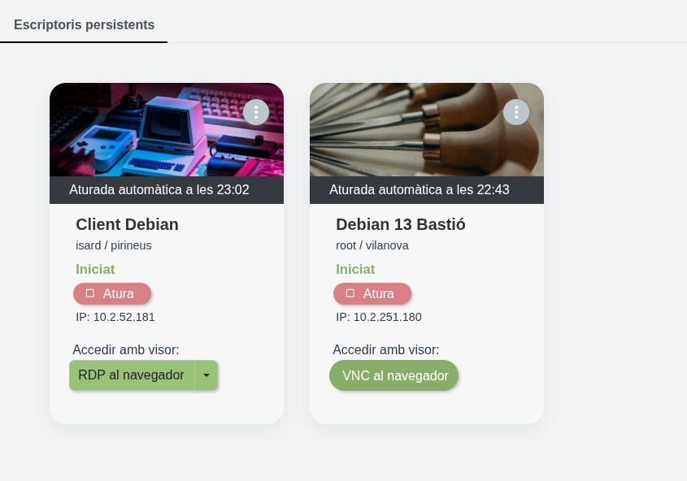
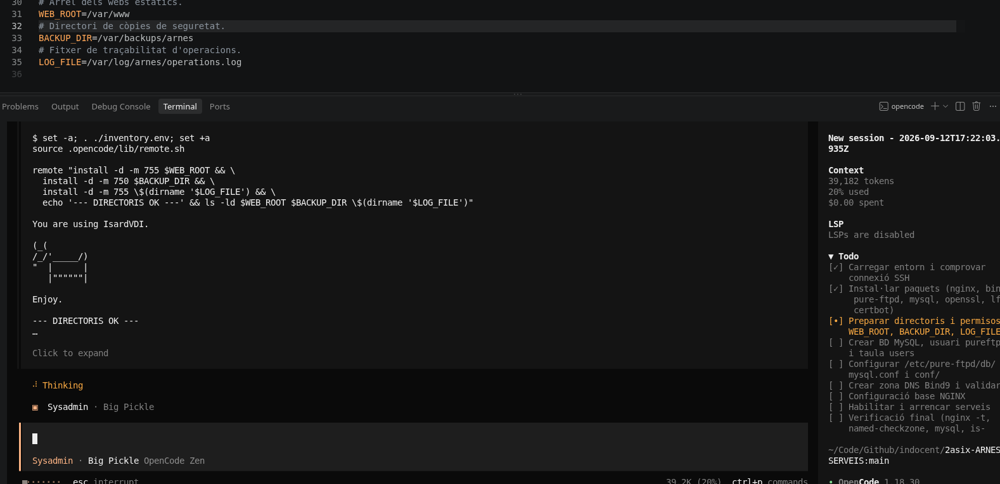
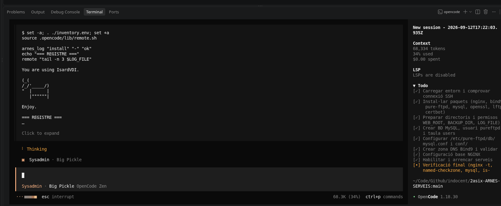
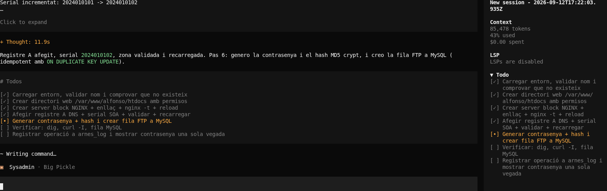
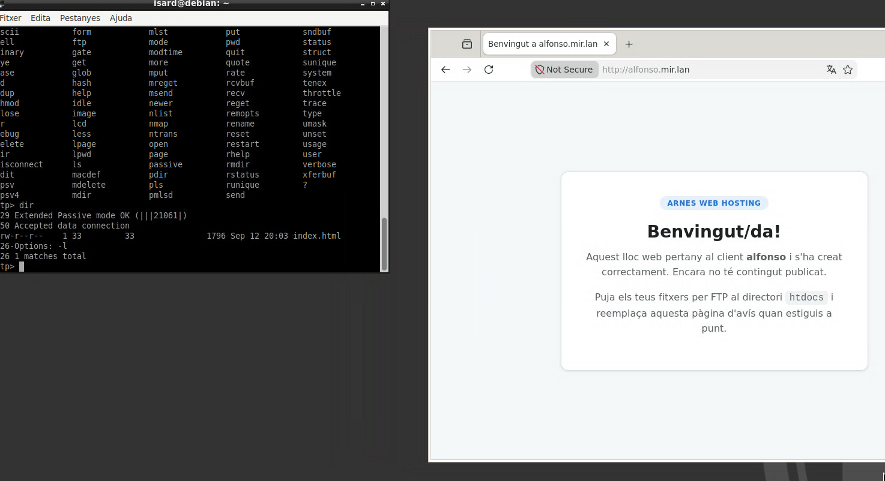
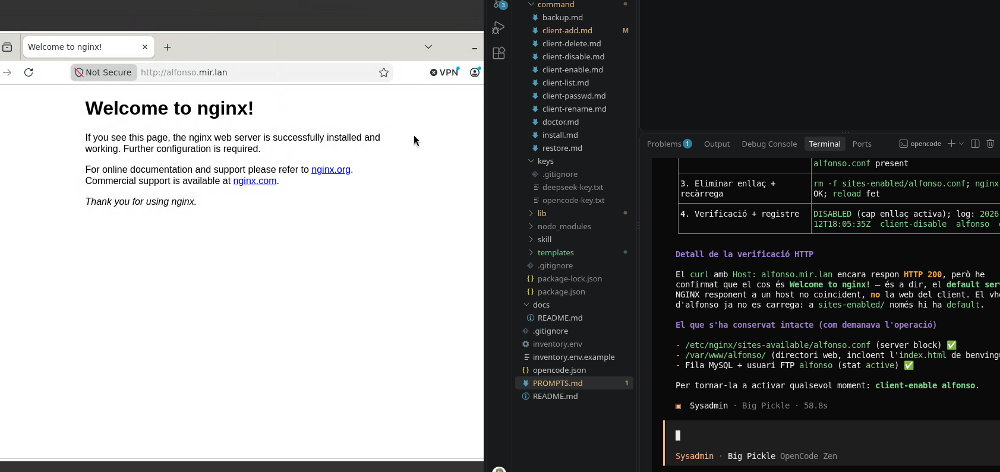
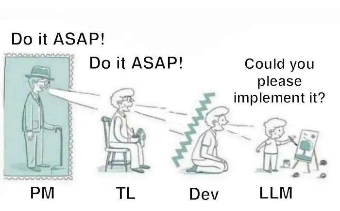

# INFORME

Aquest curs sóc docent del mòdul de Serveis de 2n d'ASIX i vull introduïr els conceptes d'opencode, arnès, agents, etc.

Per aquest motiu he creat aquest projecte on he definit un arnés per a gestionar un hosting web bàsic. El hosting està allotjat en un servidor remot que s'accedirà per SSH i consistirà en un servidor web (NGINX), un servidor de DNS (BIND9) i un servidor FTP amb usuaris virtuals (PureFTPD amb MySQL). Mitjançant l'arnès es podrà fer la instal·lació inicial del servidor, donar d'alta un client, donar de baixa, etc.

El resultat de l'arnés es pot trobar en aquest repositori: [https://github.com/indocent/2asix-ARNES-SERVEIS](https://github.com/indocent/2asix-ARNES-SERVEIS).

## Primer PROMPT

Primer he definit aquest promtp:

```markdown
Crea i afegeix a PROMPTS.md un prompt per a definir un arnés d'opencode que serveixi per administrar un servidor debian remot accedint per SSH.

Mitjançant l'arnés s'administrarà un servidor web NGINX, un servidor de DNS Bind9 autoritari d'una zona, i un servidor PureFTPD amb usuaris virtuals en una base de dades MySQL.

Aquest servidor servirà per a allotjar pàgines web estàtiques a diversos clients. Cada client tindrà un subdomini i un usuari virtual de FTP amb el mateix nom per a poder desplegar la seva web

L'arnés permetrà:

* instal·lar en un servidor tot el programari necessari i configurar-lo
* donar d'alta un nou client i que es generi una contrasenya segura
* deshabilitar i tornar a habilitar la web d'un client
* canviar el password d'un client
* canviar el nom d'un client
* esborrar un client, fent una copia de seguretat per si de cas
```

## Segon i tercer PROMTPs

A partir d'aquest PROMTP, m'ha generat aquest 2n promt, que no copio per ser molt llarg, però que es pot consultar aquí.

* [https://github.com/indocent/2asix-ARNES-SERVEIS/blob/main/PROMPTS.md#prompt-2](https://github.com/indocent/2asix-ARNES-SERVEIS/blob/main/PROMPTS.md#prompt-2)

Aquest 2n PROMT l'he anat refinant parlant amb el model i finalment m'ha generat un 3r prompt mes concret que he fet servir per construir l'arnès en una nova sessió. Aquest 3r promtp es pot consultar aquí:

* [https://github.com/indocent/2asix-ARNES-SERVEIS/blob/main/PROMPTS.md#prompt-3](https://github.com/indocent/2asix-ARNES-SERVEIS/blob/main/PROMPTS.md#prompt-3)

## Prova de l'arnès

Per prova l'arnès he creat dues màquines a [IsardVDI](https://elmeuescriptori.gestioeducativa.gencat.cat/).



Desprès he iniciat l'arnès amb el model **big-pickle** d'opencode, per tal de simular el mateix entorn de l'alumnat.

En primer lloc he demanat que instal·li tot plegat al servidor, i ho ha fet, amb diversos intents i correccions que s'ha gestionat el model mateix.





Desprès he demanat que doni d'alta l'usuari **alfonso**:



En aquest punt ha trigat força, amb problemes de MySQL, però ho ha resolt tot sol i m'ha creat el subdomini, la web i m'ha donat accés per FTP:



Desprès he demanat que deshabiliti el client, i així ho ha fet:



Amb això he concluit la prova de l'arnès.

## Conclusió

Portaré aquesta pràctica a classe, un cop hagi explicat els serveis implicats.

T'agraeixo molt la feina que has fet i acabo amb aquesta imatge, que m'ha fet mola gràcia.

